# 嵌入式实习秋招准备

## 01 岗位理解与岗位方向

- 什么是嵌入式？

  嵌入式是让微控制器或处理器在特定的硬件平台中运行指特定软件，使其实现如数据采集、信号处理、控制执行、数据传输、显示反馈等任务，以满足特定行业或应用场景的功能需求。

  嵌入式广泛应用于工业控制、智能家电、消费电子、汽车电子、医疗设备、通讯设备、机器人、物联网设备等领域


- 岗位方向

  - 嵌入式软件开发方向
    - 应用层开发：Linux用户态开发、==实时操作系统（RTOS）开发==
    - 底层驱动开发：内核剪裁与移植，驱动程序开发（在Linux内核态编写驱动程序，与硬件直接交互）


  - 自动驾驶相关方向

    - 应用层开发

      **功能开发**：基于中间件或平台提供的接口，开发自动驾驶功能模块，如路径规划、环境感知、人机交互等

      **==智能座舱开发==**：涉及车载娱乐系统、信息显示、语音交互等，提升用户的驾驶体验

      - 中间件开发

        **中间件框架**：负责封装底层操作系统和硬件接口，为上层应用提供统一的编程接口，需要对系统架构和软件设计模式有深入理解

        **通信框架**：开发汽车内部网络通信协议，确保各模块之间的数据传输可靠

      - 底层开发

        **操作系统层开发**：涉及实时操作系统的开发和优化，对系统的实时性、安全性进行保障

        **==硬件驱动开发==**：对传感器、执行器等硬件设备编写驱动程序，与硬件直接进行交互


## 02 能力要求

1. C/C++，脚本语言：Python Shell等，用于自动化测试、工具开发或数据处理

2. 数据结构与算法（数组、链表、二叉树...）

3. 操作系统与实时系统

   - Linux系统：熟悉Linux环境下的开发流程、调试工具以及常用开发库和框架（熟悉Linux环境下的软件开发、理解操作系统原理（进程/线程、内存管理等））
   - RTOS及系统内核原理：（自动驾驶、工业控制中）掌握实时操作系统、理解中断管理、任务调度与驱动开发

4. 计算机网络

   理解基础知识；熟悉TCP/IP协议；熟悉socket网络编程；ping

5. 底层开发与硬件知识

   - 驱动开发：掌握硬件接口、外设驱动程序设计、寄存器操作；对常用调试工具（示波器、逻辑分析仪）的使用有要求
   - 硬件原理基础：了解电子电路、数模电、通信协议（CAN、SPI、UART、I2C等）及常用的接口技术，能看懂原理图

6. 常见加分项

   编外技能：熟悉Git、GDB、Makefile、ROS等

   英语，竞赛，成绩排名，团队协作能力，科研成果

## 03 学习内容

1. 数据结构与算法
   - 数据结构：字符串、栈、队列、链表、堆、树、数组、哈希表等
   - 算法：查找、排序、动态规划、回溯等
2. 操作系统原理
   - 内存管理和调度
   - 多任务：多线程/并发/进程
   - 文件系统
3. 计算机网络原理
   - TCP/IP协议栈
   - 网络通信原理
4. 计算机组成原理
   - 计算机基本组成
   - 指令和总线
   - 处理器架构和设计
   - 存储系统
   - I/O系统

## 04 数据结构和算法

### 一、数组


### 二、链表

#### 10、反转链表II（92）

**题目**：给你单链表的头指针 head 和两个整数 left 和 right，其中left <= right。请你反转从位置 left 到位置 right 的链表节点，返回反转后的链表。

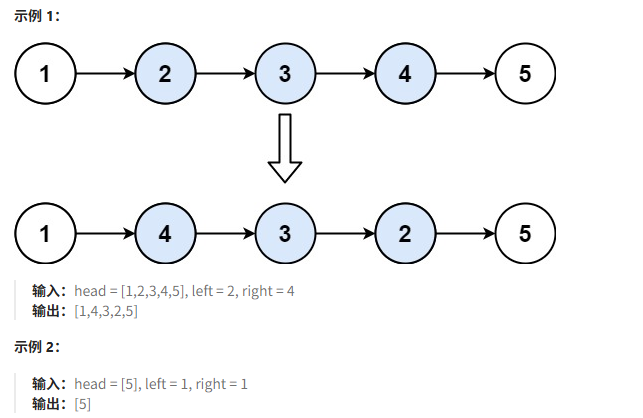

**题解：**

**法1**：一次遍历，穿针引线反转链表

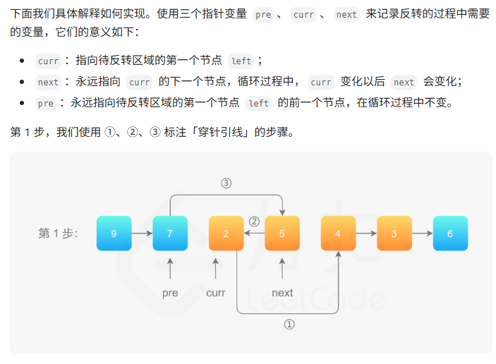

```C++
struct ListNode{                             //单链表的定义
    int val;
    ListNode *next;
    ListNode() : val(0), next(nullptr) {}
    ListNode(int x) : val(x), next(nullptr) {}
    ListNode(int x, ListNode *next) : val(x), next(next) {}
};

class Solution{
public:
    ListNode* reverseBetween(ListNode* head, int left, int right)
    {
        ListNode *dummyNode = new ListNode(0);   //创建一个虚拟头节点
        dummyNode->next = head;
        ListNode *pre = dummyNode;
        for(int i = 0; i < left-1; i++)
        {
            pre = pre->next;
        }
        ListNode *cur = pre->next;
        ListNode *temp;
        for(int i = 0; i < right - left; i++)
        {
            temp = cur->next;                   //先保存cur->next节点
            cur->next = temp->next;             //图片中的步骤1
            temp->next = pre->next;             //步骤2
            pre->next = next;                   //步骤3
        }
        return dummyNode->next;                 //返回反转后的链表头
    }
};
```

**法2**：采用206中的反转链表方法解决（反转结束后从原链表上看，pre指向反转这一段的末尾，cur指向反转这一段后续的下一个节点）

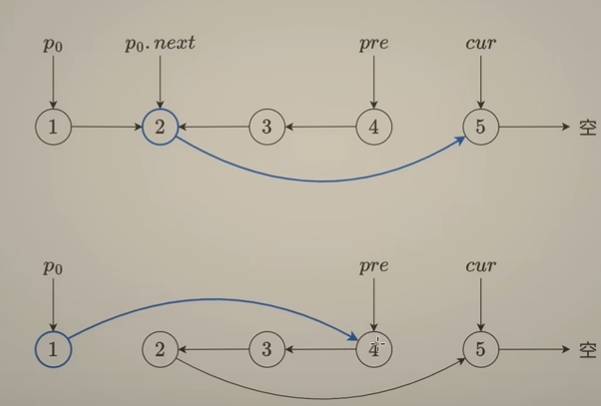

```c++
class Solution{
public:
    ListNode* reverseBetween(ListNode* head, int left, int right)
    {
        ListNode *dummyNode = new ListNode(0);
        dummyNode->next = head;
        ListNode *p0 = dummyNode;             //p0指向带反转部分的前一个节点
        for(int i = 0; i < left-1; i++)
        {
            p0 = p0->next;
        }
        ListNode *pre = NULL;                 //参考（206）反转链表
        ListNode *cur = p0->next;             //cur指向带反转链表部分的链表头
        for(int i = 0; i < right - left + 1; i++)
        {
            ListNode *temp = cur->next;
            cur->next = pre;
            pre = cur;
            cur = temp;
        }
        p0->next->next = cur;
        p0->next = pre;
        return dummyNode->next;
    }
};
```


#### 11、K个一组翻转链表（25）

**题目：**给你链表的头节点head，每k个节点一组进行翻转，请你返回修改后的链表。k是一个正整数，它的值小于或等于链表的长度。如果节点总数不是k的倍数，那么请将最后剩余的节点保持原有顺序。不能只单纯改变节点内部的值，而是需要实际进行节点交换。

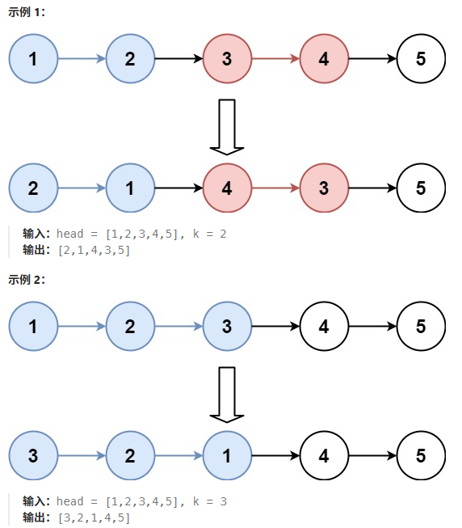

**题解**：

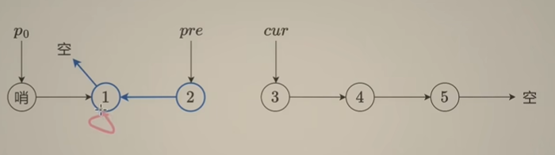

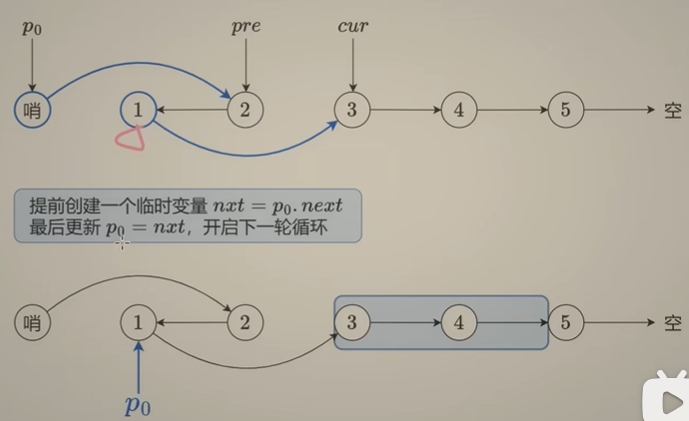

```c++
class Solution {
public:
    ListNode* reverseKGroup(ListNode* head, int k) {
       int n = 0;                                     //统计节点个数
       for(ListNode *cur = head; cur; cur = cur->next)
       {
          n++;
       }
       ListNode *dummyNode = new ListNode(0);
       dummyNode->next = head;
       ListNode *p0 = dummyNode;
       ListNode *pre = NULL;
       ListNode *cur = head;
       for(; n>=k; n-=k)                             //当节点总数不足k个时不进行反转操作
       {
            for(int i = 0; i < k; i++)               //这部分参考（92）反转链表II
            {
                ListNode *temp = cur->next;
                cur->next = pre;
                pre = cur;
                cur = temp;
            }

            ListNode *nxt = p0->next;               
            p0->next->next = cur;
            p0->next = pre;
            p0 = nxt;                              //不同之处在于每次反转完k个节点需要更新p0位置
       }
       return dummyNode->next;
    }
};
```

#### 12、随机链表的复制（138）

给你一个长度为n的链表，每个节点包含一个额外增加的随机指针random，该指针可以指向链表中的任何节点或空节点。**构造这个链表的深拷贝**。深拷贝应该正好由n个全新节点组成，其中每个新节点的值都设为其对应源节点的值。新节点的next指针和random指针也都应指向复制链表中的新节点，并使原链表和复制链表中的这些指针能够表示相同的链表状态。复制链表中的指针都不应指向原链表中的节点。

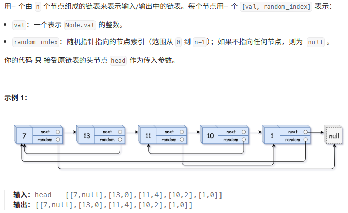

#### 13、排序列表（148）

**题目：** 给你链表的头节点head，请你按 **升序排列** 并返回排列后的链表。

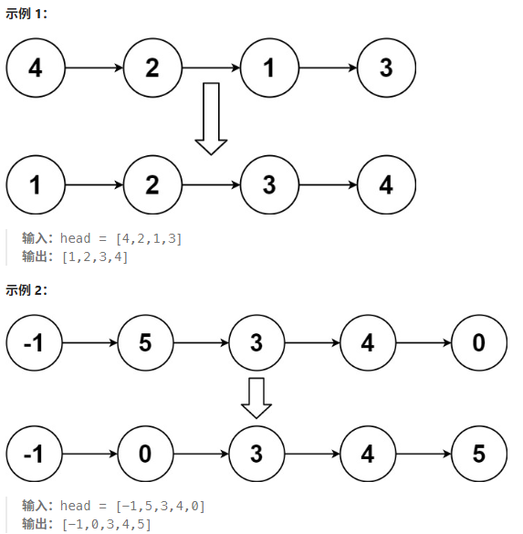

**题解：** 归并排序（分治）

1）找到链表的中间节点head2的前一个节点，并断开head2与前一个节点的连接。这样就把原链表均分成了两段更短的链表。

2）分治，递归调用 sortList，分别排序 head (前一半)和 head2 (后一半)。

3）排序后，得到两个有序链表，合并两个有序链表得到排序后的链表，返回该链表的头节点。

```c++
struct ListNode{
    int val;
    ListNode *next;
    ListNode() : val(0), next(nullptr) {}
    ListNode(int x) : val(x),  next(nullptr) {}
    ListNode(int x, ListNode * next) : val(x), next(next) {}
};

class Solution{
    ListNode* middleNode(ListNode *head)
    {
        //876.找链表的中间节点（快慢指针）
        ListNode *pre = head;
        ListNode *slow = head;
        ListNode *fast = head;
        while(fast && fast->next)
        {
            pre = slow;    //暂存 slow 的前一个节点
            slow = slow->next;
            fast = fast->next->next;
        }
        pre->next = NULL;  //断开 slow 的前一个节点和 slow 的连接
        return slow;
    }
    
    ListNode* mergeTwoLists(ListNode *list1, ListNode *list2)
    {
        //21.合并两个有序链表(双指针)
        ListNode *dummyNode = new ListNode(0);  //创建虚拟头节点
        ListNode *cur = dummyNode;
        while(list1 && list2)
        {
            if(list1->val < list2->val)
            {
                cur->next = list1;
                list1 = list1->next;
            }
            else
            {
                cur->next = list2;
                list2 = list2->next;
            }
            cur = cur->next;
        }
        cur->next = list1 ? list1 : list2;  //拼接剩余链表
        ListNode *result = dummyNode->next;
        delete dummyNode;
        return result;
    }
public:
    ListNode* sortList(ListNode *head)
    {
        if(head == NULL || head->next == NULL)   //如果链表为空或者只有一个节点，无需排序直接返回
        {
            return head;
        }
        //找到中间节点 head2，并断开 head2 与前面节点的链接
        head2 = middleNode(head);
        //分治
        head = sortList(head);
        head2 = sortList(head2);
        //合并
        return mergeTwoLists(head,head2);
    }
};
```

#### 14、合并k个升序链表（23）

**题目：** 给你一个链表数组，每个链表都已经按升序排列。请你将所有链表合并到一个升序链表中，返回合并后的链表。

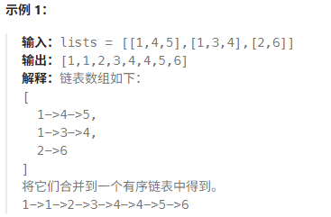

**题解：** 

分治法：把 lists 一分为二（尽量均分），先合并前一半的链表，再合并后一半的链表，然后把这两个链表合并成最终的链表。对于前一半的链表，我们可以继续一分为二。如此分下去直到只有一个链表，此时无需合并。

```c++
struct ListNode{
    int val;
    ListNode *next;
    ListNode() : val(0), next(nullptr) {}
    ListNode(int x) : val(x),  next(nullptr) {}
    ListNode(int x, ListNode * next) : val(x), next(next) {}
};
class Solution{
    //合并两个有序链表
    ListNode* mergeTwoLists(ListNode *list1, ListNode *list2)
    {
        ListNode *dummyNode = new ListNode(0);
        ListNode *cur = dummyNode;
        while(list1 && list2)
        {
            if(list1->val < list2->val)
            {
                cur->next = list1;
                list1 = list1->next;
            }
            else
            {
                cur->next = list2;
                list2 = list2->next;
            }
            cur = cur->next;
        }
        cur->next = list1 ? list1 : list2;
        ListNode *result = dummyNode->next;
        delete dummyNode;
        return result;
    }
    
    //合并从 lists[i] 到 lists[j-1] 的链表
    ListNode* mergeKLists(vector<ListNode*>& lists, int i, int j)
    {
        int m = j-i;
        if(m == 0)   //空链表
        {
            return NULL;
        }
        if(m == 1)   //只有一个链表
        {
            return lists[i];
        }
        auto left = mergeKLists(lists, i, i+m/2);   //合并左半部分
        auto right = mergeKLists(lists, i+m/2, j);  //合并右半部分
        return mergeTwoLists(left, right);          //最后将左半和右半合并
    }
public:
    ListNode* mergeKLists(vector<ListNode*>& lists)
    {
        return mergeKLists(lists, 0, lists.size());
    }
};
```

#### 15、LRU缓存（146）

请你设计并实现一个满足LRU（最近最少使用）缓存约束的数据结构。实现LRUCache类：1）LRUCache(int capacity) 以正整数作为容量 capacity 初始化 LRU 缓存。 2）int get(int key) 如果关键词 key 存在于缓存中，则返回关键字的值，否则返回-1。3）void put(int key, int value) 如果关键字 key 已经存在，则变更其数据值 value；如果不存在，则向缓存中插入该组 key-value。如果插入操作导致关键字数量超过 capacity，则应该逐出最久未使用的关键字。


### 三、哈希表

**用途：** 解决某个元素是否在集合中出现过的问题

#### 1、有效的字母异位词（242）

**题目：** 给定两个字符串 s 和 t，编写一个函数来判断 t 是否是 s 的 **字母异位词** 。（s,t仅包含小写字母。判断两个字符串是不是由相同的字母组成，字母的位置可以不一样）

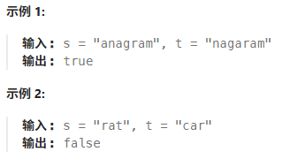

**方法：** 数组+哈希表(用于哈希值较小且范围可控的情况下)

定义一个长度为26的哈希数组（默认初始化所有元素值为0），用这个数组统计第一个字符串里出现过字母的频率；遍历第二个字符串，将出现的字符在该数组对应位置做减1操作；最后判断哈希数组中全部元素是否全为0，全为0证明这两个字符串是有效字母异位词，否则则不是。

**题解：** 

```c++
class Solution{
public:
    bool isAnagram(string s, string t)
    {
        int hash[26] = {0};
        for(int i = 0; i < s.size(); i++)  //遍历第一个字符串
        {
            hash[s[i] - 'a']++;            //加法统计第一个字符串里出现过字母的频率
        }
        for(int i = 0; i < t.size(); i++)  //遍历第二个字符串
        {
            hash[t[i] - 'a']--;            //减法统计第二个字符串里出现过字母的频率
        }
        for(int i = 0; i < 26; i++)
        {
            if(hash[i] != 0)
            {
                return false;
            }
        }
        return true;
    }
};
```

#### 2、两个数组的交集（349）

**题目** 给定两个数组 nums1 和 nums2，返回它们的交集。输出结果中的每个元素一定是唯一的。我们可以不考虑输出结果的顺序。

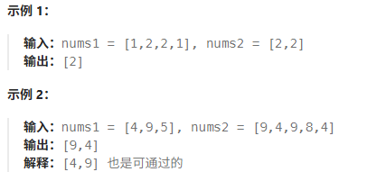

**方法1：**  集合（set）+哈希表（用于哈希值较大，没有限制的情形）

处理数组 nums1，将其转化为哈希表的形式；再遍历数组 nums2 中的元素来查询哈希表中是否出现过，如果出现过，就将该元素放进result 集合里。(这里选择 unordered_set 这种底层实现是哈希表的结构，其查询效率最高)

```c++
class Solution{
public:
    vector<int> intersection(vector<int>& nums1, vector<int>& nums2)
    {
        unordered_set<int> result_set;   //存放结果，直接为去重后的结果
        unordered_set<int> nums_set(nums1.begin(), nums1.end()); //直接将nums1数组转换为哈希表
        for(int i = 0; i < nums2.size(); i++)
        {
            if(nums_set.find(nums2[i]) != nums_set.end())
            {
                result_set.insert(nums2[i]);
            }
        }
        return vector<int>(result_set.begin(), result_set.end());  //将哈希表转换为数组输出
    }
};
```

**方法2**  数组+哈希表（力扣上对于这两个数组的大小做了限制，不超过1000）

直接使用 set 不仅占用空间比数组大，而且速度要比数组慢，set 把数值映射到 key 上都是要做 hash 计算的

```c++
class Solution{
public:
    vector<int> intersection(vector<int>& nums1, vector<int>& nums2)
    {
        unordered_set<int> result_set;   //存放结果，直接为去重后的结果
        int hash[1005] = {0};
        for(int i = 0; i < nums1.size(); i++)
        {
            hash[nums1[i]] = 1;
        }
        for(int i = 0; i < nums2.size(); i++)
        {
            if(hash[nums2[i]] == 1)
            {
                result_set.insert(nums2[i]);
            }
        }
        return vector<int>(result_set.begin(), result_set.end());
    }
};
```

#### 3、快乐数（202）

**题目：** 编写一个算法来判断一个数 n 是不是快乐数。快乐数定义为：1）对于一个正整数，每一次将该数替换为它每个位置上的数字平方和。2）然后重复这个过程直到这个数变为1，也可能是无限循环但始终变不到1.3）如果这个过程结果为1，那么这个数就是快乐数。如果 n 是快乐数就返回 true，否则返回 false

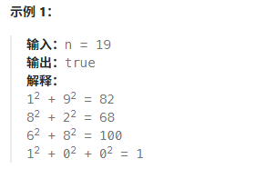

**方法：** 使用哈希法判断 sum 是否重复出现，如果重复出现了就是 false，否则一直找到 sum = 1为止

**题解：** 

```c++
class Solution {
public:
    bool isHappy(int n) {
        
    }
};
```

#### 4、两数之和（1）

**题目：** 给定一个整数数组 nums 和一个整数目标值 target，请你在该数组中找出和为目标值 target 的那两个整数，并返回它们的数组下标。你可以假设每种输入只会对应一个答案，并且你不能使用两次相同的元素，你可以按照任意顺序返回答案。


**方法：** 定义一个集合来存放遍历过的元素，然后在遍历数组的时候去访问这个集合来判断某元素是否遍历过，也就是是否出现在这个集合中。本题不仅需要知道元素有没有遍历过，还要知道这个元素对应的下标，需要用 key-value 结构来存放，key 存放元素，value存放下标，因此采用map数据结构

**题解：** 

```c++
class Solution {
public:
    vector<int> twoSum(vector<int>& nums, int target) {
        
    }
};
```

#### 5、四数相加II（454）

**题目：** 给定四个包含整数的数组列表A，B，C，D，计算有多少个元组(i,j,k,l)，使得A[i]+B[j]+C[k]+D[l] = 0。为了使问题简化，所有的A，B，C，D具有相同的长度 N，且 0 <= N <= 50，所有整数范围在 -2^28-2^28-1之间，最终结果不会超过2^31-1。

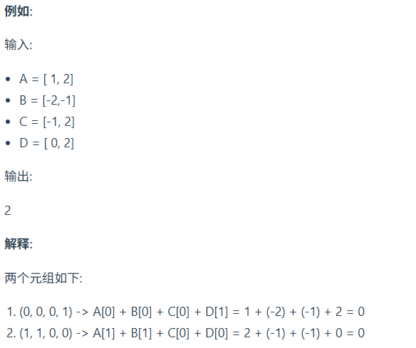

**方法：** map + 哈希法

1）首先定义一个 unorderd_map，key放a和b两数之和，value放a和b两数之和出现的次数。

2）遍历大A和大B数组，统计两个数组元素之和以及和出现的次数，放到map中。

3）定义int变量count，用来统计a+b+c+d=0出现的次数。

4）再遍历大C和大D数组，找到如果0-(c+d)在map中出现过的话，就用count把map中key对应的value也就是出现次数统计出来。

**题解：** 

```c++
class Solution {
public:
    int fourSumCount(vector<int>& nums1, vector<int>& nums2, vector<int>& nums3, vector<int>& nums4) {
       
    }
};
```

#### 6、赎金信（383）

**题目：** 给你两个字符串：ransomNote和magazine，判断ransomNote能不能由magazine里面的字符构成。如果可以，返回true，否则返回false。magazine中的每个字符只能在ransomNote中使用一次。

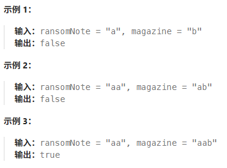

**方法：** 类似有效的字母异位词（242）采用数组+哈希法解题，自己做出来的第一题，开心开心！

**题解：** 

```c++
class Solution {
public:
    bool canConstruct(string ransomNote, string magazine) {
        int hash[26];
        for(int i = 0; i < magazine.size(); i++)
        {
            hash[magazine[i] - 'a']++;
        }
        for(int i = 0; i < ransomNote.size(); i++)
        {
            hash[ransomNote[i]-'a']--;
        }
        for(int i = 0; i < 26; i++)
        {
            if(hash[i] < 0)
            {
                return false;
            }
        }
        return true;
    }
};
```

#### 7、三数之和（15）

**题目：** 给你一个整数数组nums，判断是否存在三元组[nums[i],nums[j],nums[k]]满足i!=j、i!=k且j!=k，同时还满足nums[i]+nums[j]+nums[k]==0.请你返回所有和为0且不重复的三元组。注意答案中不能包含重复的三元组。

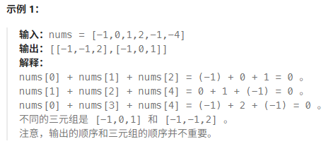

**方法：** 双指针法。首先将数组排序，然后有一层for循环，i从下标0的地方开始，同时定一个下标left定义在i+1的位置上，定义下标right在数组结尾的位置上。依然是在数组中找到abc使得a+b+c=0，这里相当于a = nums[i]，b = nums[left]，c = nums[right]。如何移动left和right呢，如果nums[i]+nums[left]+nums[right] < 0说明此时三数之和小了，left右移，大于0则right左移，直到left和right相遇为止。去重逻辑：对于a的去重，当i>0 && nums[i] == nums[i-1]时，跳过该轮for循环；b和c的去重则是每当满足right > left && nums[left] == nums[left+1]时，持续进行left++的操作。

**题解：** 

```c++

```


### 十、排序算法

#### 1、选择排序


#### 2、冒泡排序


#### 3、插入排序


#### 4、快速排序


#### 5、归并排序


#### 6、堆排序


#### 7、桶排序


#### 8、计数排序


#### 9、基数排序


## 05 硬件知识

### 1、ARM架构

#### 1.1 RISC

ARM 芯片属于精简指令集计算机（RISC），它所用的指令比较简单，有如下特点：

1）对内存只有读、写指令

2）对于数据的运算是在cpu内部实现的

3）使用RISC指令的cpu复杂度小一点，易于设计

#### 1.2 CPU 内部寄存器

cpu 内部有逻辑运算单元 ALU 和寄存器（用于暂存数据）

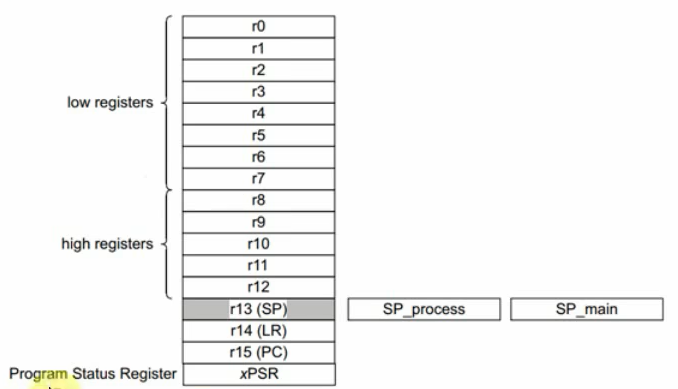

无论是cortex-M3/M4，还是cortex-M7，cpu内部都有R0-R15寄存器，对于R13、R14、R15还另有用途：

R13：SP(Stack Pointer)，栈指针

R14：LR(Link Register)，用于保存返回地址

R15：PC(Program Counter)，程序计数器，表示当前指令地址，写入新值即可跳转